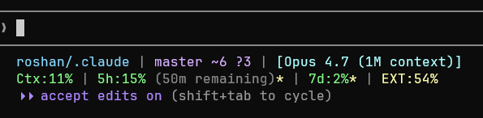

# Claude Code Statusline

A two-line colored statusline for Claude Code that shows repo/branch, model, context %, and your Claude Pro/Max plan usage (5-hour session, 7-day weekly, extended).



```
roshan/.claude | master ~6 ?3 | [Opus 4.7 (1M context)]
Ctx:11% | 5h:15% (50m remaining)* | 7d:2%* | EXT:54%
```

Colors shift by threshold: **green <40%**, **yellow <60%**, **orange <80%**, **red ≥80%**. A `*` after `5h:` or `7d:` means the cache is stale (>5 min old — usually a transient API failure).

---

## How it works

Two scripts per platform:

1. **Statusline script** — invoked by Claude Code on every prompt. Reads a JSON payload from stdin, reads a local cache file for plan usage, prints the two lines. Must be fast, so it never calls the API directly.
2. **Usage fetcher** — calls `https://api.anthropic.com/api/oauth/usage` using your OAuth token from `~/.claude/.credentials.json`, writes the response (plus friendly timestamps) to `~/.claude/usage-cache.json`. The statusline fires this in the background when the cache is >2 minutes old; you can also run it manually.

This two-tier design is why the statusline feels instant — the API call only happens in the background.

---

## Install — Windows

### Requirements

- PowerShell 5.1 (built into Windows) or PowerShell 7+ (`pwsh`)
- `git` on `PATH`
- Claude Code logged in (so `%USERPROFILE%\.claude\.credentials.json` exists)

### Steps

**1. Copy both scripts into `%USERPROFILE%\.claude\`:**

```powershell
Copy-Item .\windows\Statusline.ps1      "$env:USERPROFILE\.claude\Statusline.ps1"
Copy-Item .\windows\Get-ClaudeUsage.ps1 "$env:USERPROFILE\.claude\Get-ClaudeUsage.ps1"
```

**2. Unblock the scripts** — required if you downloaded the repo as a zip from GitHub (Windows tags every file inside as "from the internet" via Mark-of-the-Web, and PowerShell refuses to run tagged `.ps1` files):

```powershell
Unblock-File -Path "$env:USERPROFILE\.claude\Statusline.ps1"
Unblock-File -Path "$env:USERPROFILE\.claude\Get-ClaudeUsage.ps1"
```

Running `Unblock-File` on an already-unblocked script is a harmless no-op, so it's safe to run regardless.

**3. Register the statusline in `%USERPROFILE%\.claude\settings.json`:**

If the file doesn't exist yet:

```json
{
  "statusLine": {
    "type": "command",
    "command": "pwsh -NoProfile -ExecutionPolicy Bypass -File %USERPROFILE%\\.claude\\Statusline.ps1"
  }
}
```

If the file already exists, merge the `statusLine` key into the top-level object — don't replace what's there:

```json
{
  "permissions": { ... existing ... },
  "env": { ... existing ... },
  "statusLine": {
    "type": "command",
    "command": "pwsh -NoProfile -ExecutionPolicy Bypass -File %USERPROFILE%\\.claude\\Statusline.ps1"
  }
}
```

The `-ExecutionPolicy Bypass` flag is important — Windows' default `Restricted` execution policy blocks *all* unsigned `.ps1` files. Bypass only applies to this single invocation; it doesn't change your system-wide policy. Use `powershell` instead of `pwsh` if you don't have PowerShell 7 installed.

**4. Prime the cache once:**

```powershell
pwsh -NoProfile -ExecutionPolicy Bypass -File "$env:USERPROFILE\.claude\Get-ClaudeUsage.ps1"
```

**5. Start a new Claude Code session.** The statusline should appear below the prompt.

---

## Install — Linux / macOS

One pair of bash scripts handles both. OS is detected at runtime via `uname -s`, and the two real differences (GNU `date -d` vs BSD `date -j -f`, `stat -c %Y` vs `stat -f %m`) are branched internally.

### Requirements

- `bash` (any modern version; macOS 3.2 works)
- `jq`, `curl`, `git` on `PATH`
- Claude Code logged in (so `~/.claude/.credentials.json` exists)

**Install dependencies if missing:**

```bash
# Ubuntu / Debian
sudo apt install jq curl git

# Fedora / RHEL
sudo dnf install jq curl git

# Arch
sudo pacman -S jq curl git

# macOS
brew install jq
xcode-select --install   # if git is missing
```

### Steps

**1. Copy both scripts into `~/.claude/` and make them executable:**

```bash
install -m 755 unix/statusline.sh        ~/.claude/statusline.sh
install -m 755 unix/get-claude-usage.sh  ~/.claude/get-claude-usage.sh
```

**2. Register the statusline in `~/.claude/settings.json`:**

If the file doesn't exist yet:

```json
{
  "statusLine": {
    "type": "command",
    "command": "bash $HOME/.claude/statusline.sh"
  }
}
```

If the file already exists, merge the `statusLine` key into the top-level object — don't replace what's there:

```json
{
  "permissions": { ... existing ... },
  "env": { ... existing ... },
  "statusLine": {
    "type": "command",
    "command": "bash $HOME/.claude/statusline.sh"
  }
}
```

**3. Prime the cache once:**

```bash
~/.claude/get-claude-usage.sh
```

**4. Start a new Claude Code session.**

---

## Testing

Run these after install to verify everything works.

### Windows (PowerShell)

**1. Syntax check (no execution):**

```powershell
$null = [scriptblock]::Create((Get-Content "$env:USERPROFILE\.claude\Statusline.ps1" -Raw))
$null = [scriptblock]::Create((Get-Content "$env:USERPROFILE\.claude\Get-ClaudeUsage.ps1" -Raw))
```

No output = parsing succeeded.

**2. Statusline with a fake payload:**

```powershell
$payload = @{
  model          = @{ display_name = 'Opus 4.7 (1M context)' }
  workspace      = @{ current_dir  = $PWD.Path }
  context_window = @{
    total_input_tokens  = 24000
    total_output_tokens = 6000
    context_window_size = 200000
  }
} | ConvertTo-Json -Depth 5
$payload | pwsh -NoProfile -ExecutionPolicy Bypass -File "$env:USERPROFILE\.claude\Statusline.ps1"
"`n"
```

Expected: two colored lines; `Ctx:15%` in green.

**3. Live API fetch:**

```powershell
pwsh -NoProfile -ExecutionPolicy Bypass -File "$env:USERPROFILE\.claude\Get-ClaudeUsage.ps1" -Force -OutputPath "$env:TEMP\test-usage.json" -Silent
Get-Content "$env:TEMP\test-usage.json" | ConvertFrom-Json | Select five_hour, seven_day
```

Expected: `utilization_rounded` filled in for both, `resets_at_friendly` in local time.

**4. Stale-cache `*` indicator:**

```powershell
$p = "$env:USERPROFILE\.claude\usage-cache.json"
$c = Get-Content $p -Raw | ConvertFrom-Json
$c.last_updated = '2020-01-01T00:00:00Z'
$c | ConvertTo-Json -Depth 10 | Set-Content $p -Encoding UTF8

'{"model":{"display_name":"Opus"},"workspace":{"current_dir":"C:\\"}}' |
  pwsh -NoProfile -ExecutionPolicy Bypass -File "$env:USERPROFILE\.claude\Statusline.ps1"
"`n"
pwsh -NoProfile -ExecutionPolicy Bypass -File "$env:USERPROFILE\.claude\Get-ClaudeUsage.ps1" -Force | Out-Null
```

Expected: yellow `*` after `5h:` and `7d:` in the stale run, gone after the refresh.

### Linux / macOS (bash)

**1. Syntax check:**

```bash
bash -n ~/.claude/statusline.sh
bash -n ~/.claude/get-claude-usage.sh
```

**2. Statusline with a fake payload:**

```bash
printf '%s' '{
  "model": {"display_name": "Opus 4.7 (1M context)"},
  "workspace": {"current_dir": "'"$PWD"'"},
  "context_window": {
    "total_input_tokens": 24000,
    "total_output_tokens": 6000,
    "context_window_size": 200000
  }
}' | bash ~/.claude/statusline.sh
echo
```

Expected: two colored lines; `Ctx:15%` in green.

**3. `used_percentage` path + non-git dir:**

```bash
printf '%s' '{
  "model": {"display_name": "Haiku 4.5"},
  "workspace": {"current_dir": "/tmp"},
  "context_window": {"used_percentage": 72}
}' | bash ~/.claude/statusline.sh
echo
```

Expected: `Ctx:72%` in orange (60-80 band).

**4. Live API fetch:**

```bash
CLAUDE_USAGE_VERBOSE=1 ~/.claude/get-claude-usage.sh --force --output /tmp/test-usage.json --silent
jq '{five_hour, seven_day, extended: .extended.active}' /tmp/test-usage.json
```

Expected: integer `utilization_rounded`, friendly local-time reset timestamps, `extended: true/false`.

**5. Stale-cache `*` indicator:**

```bash
jq '.last_updated = "2020-01-01T00:00:00Z"' ~/.claude/usage-cache.json > /tmp/stale.json
mv /tmp/stale.json ~/.claude/usage-cache.json
printf '%s' '{"model":{"display_name":"Opus"},"workspace":{"current_dir":"'"$PWD"'"}}' \
  | bash ~/.claude/statusline.sh
echo
~/.claude/get-claude-usage.sh --force    # clears the stale marker
```

Expected: yellow `*` after `5h:` / `7d:` in the stale run, gone after refresh.

---

## Manual usage of the fetcher

**Windows** — once you've run `Unblock-File` (install step 2), these work:

```powershell
& "$env:USERPROFILE\.claude\Get-ClaudeUsage.ps1"             # print current usage
& "$env:USERPROFILE\.claude\Get-ClaudeUsage.ps1" -Force      # force refetch
& "$env:USERPROFILE\.claude\Get-ClaudeUsage.ps1" -OutputPath .\usage.json
```

If you skipped `Unblock-File` or your execution policy is restrictive, use the bypass form instead:

```powershell
pwsh -NoProfile -ExecutionPolicy Bypass -File "$env:USERPROFILE\.claude\Get-ClaudeUsage.ps1" -Force
```

**Linux / macOS:**
```bash
~/.claude/get-claude-usage.sh                                  # print current usage
~/.claude/get-claude-usage.sh --force                          # force refetch
~/.claude/get-claude-usage.sh --silent --output /tmp/u.json    # no console, write to file
CLAUDE_USAGE_VERBOSE=1 ~/.claude/get-claude-usage.sh --force   # see what it's doing
```

---

## Troubleshooting

| Symptom | Cause / fix |
|---|---|
| No statusline appears | Settings key wrong or path typo. Re-run the fake-payload test — any error will be visible. |
| `Credentials file not found` | Run `claude` to log in first. |
| `No OAuth access token found` | Credentials file exists but token missing — log out and back in. |
| `*` next to `5h:` / `7d:` persists | Run the fetcher with `--force` / `-Force` — if it fails, the API or token is the problem. |
| 5h / 7d numbers don't appear at all | Cache file doesn't exist yet. Run the fetcher once to create `~/.claude/usage-cache.json`. |
| `jq: command not found` (Unix) | Install `jq` — see dependencies section. |
| `[: X.X: integer expression expected` (Unix) | Cache was written by an older build. Run `--force` once to rewrite it with ints. |
| `pwsh` not recognized (Windows) | You don't have PowerShell 7 — use `powershell` in the settings command instead. |
| `... cannot be loaded because running scripts is disabled on this system` (Windows) | Default execution policy is `Restricted`. The settings command uses `-ExecutionPolicy Bypass` to handle this; if you're running manually, prefix with `pwsh -NoProfile -ExecutionPolicy Bypass -File ...`. |
| `... is not digitally signed ... not permitted to run` (Windows) | Mark-of-the-Web from a zip download. Run `Unblock-File -Path "$env:USERPROFILE\.claude\*.ps1"`. |

---

## Folder layout

```
Statusline/
├── README.md              (this file — everything you need)
├── assets/preview.png     screenshot used in this README
├── windows/
│   ├── Statusline.ps1
│   └── Get-ClaudeUsage.ps1
└── unix/
    ├── statusline.sh      handles both Linux and macOS via uname -s
    └── get-claude-usage.sh
```

The same cache schema (`~/.claude/usage-cache.json`) is used by all three implementations, so machines can share it.
